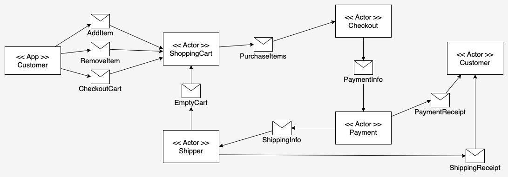

# Implementing the cascading style of the Actor Model under Akka

This project is an implementation of the cascading style of the Actor Model. In the cascading in which actors operate
sequentially, yet independently toward a given end in a workflow can be thought of as a cascading style.
Figure 1 below illustrates an example of implementing the Barry Peanuts Shopping Cart demonstration application in such
a style.

|  |
|----------------------------------------------------------|
| Figure 1: The cascading style of the Actor Model         |

# Running the code:

The [Java Virtual Machine](https://openjdk.org/) and [Maven](https://maven.apache.org/install.html) need to be installed
on the host computer.

## (1) Confirm that Java and Maven are installed on the host machine

Confirm that Java is installed:

```bash
java --version
```

You'll get output similar to the following:

```bash
openjdk 18.0.2-ea 2022-07-19
OpenJDK Runtime Environment (build 18.0.2-ea+9-Ubuntu-222.04)
OpenJDK 64-Bit Server VM (build 18.0.2-ea+9-Ubuntu-222.04, mixed mode, sharing)
```

Confirm that Maven is installed:

```bash
mvn --version
```

You'll get output similar to the following:

```bash
Maven home: /usr/share/maven
Java version: 18.0.2, vendor: Oracle Corporation, runtime: /usr/lib/jvm/jdk-18.0.2
Default locale: en_US, platform encoding: UTF-8
OS name: "linux", version: "5.19.0-46-generic", arch: "amd64", family: "unix"
```

## (2) Start the application

```
mvn compile exec:exec
```