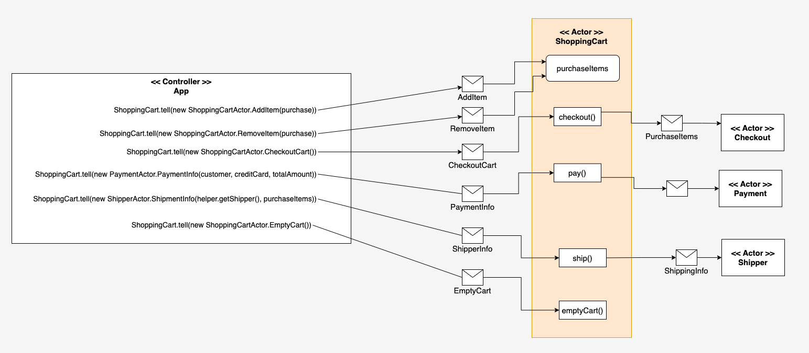

# Implementing a flattened version of the Actor model under Akka

This project is an example of the flattened style of the Actor Model under Akka.

In the flat style there is a central controller actor, in this case the Application which in turn,
controls the behavior in the workflow exclusively through the ShoppingCart. The ShoppingCart delegates
various behaviors to other actors. For example, telling the ShoppingCart to `checkout` will, in turn, have
the ShoppingCart fire off a message to the CheckOut actor. Once the checkout process is completed,
the Shopping cart then sends a message to the Payment actor to instigate payment behavior.
After payment completes, the ShoppingCart sends a message to the Shipper actor to facilitate shipping. (See Figure 1.)

|     |
|----------------------------------------------------|
| Figure 1: The flat actor-controller implementation |

One benefit of the flat style is the ease of implementation as well as ease of maintenance.

# Running the code:

The [Java Virtual Machine](https://openjdk.org/) and [Maven](https://maven.apache.org/install.html) need to be installed
on the host computer.

## (1) Confirm that Java and Maven are installed on the host machine

Confirm that Java is installed:

```bash
java --version
```

You'll get output similar to the following:

```bash
openjdk 18.0.2-ea 2022-07-19
OpenJDK Runtime Environment (build 18.0.2-ea+9-Ubuntu-222.04)
OpenJDK 64-Bit Server VM (build 18.0.2-ea+9-Ubuntu-222.04, mixed mode, sharing)
```

Confirm that Maven is installed:

```bash
mvn --version
```

You'll get output similar to the following:

```bash
Maven home: /usr/share/maven
Java version: 18.0.2, vendor: Oracle Corporation, runtime: /usr/lib/jvm/jdk-18.0.2
Default locale: en_US, platform encoding: UTF-8
OS name: "linux", version: "5.19.0-46-generic", arch: "amd64", family: "unix"
```

## (2) Start the application

```
mvn compile exec:exec
```