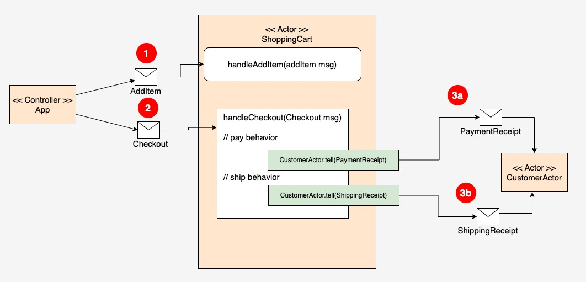

# Implementing the Actor model under Akka

This project demonstrates an Akka application, written in Java that simulates the activities of an e-commerce shopping cart.

Figure 1 below illustrates the organization and operation of the demonstration project. The client/controller component named `App` sends a 
message of type `AddItem` to the `ShoppingCartActor` to a add purchase item(s) to the shopping cart as shown in Figure 1, callout 1.

To instigate the checkout process, the `App` sends a message of type `Checkout` to the `ShoppingCartActor`. (See Figure 1, callout 2.)
The `ShoppingCartActor` executes payment and shipping behavior as part of the checkout process. At the end of the payment logic,
the `ShoppingCartActor` sends a fire-and-forget message of type `PaymentReceipt` to the `CustomerActor`. (See Figure 1, callout 3a.)

At the end of shipping logic the `ShoppingCartActor` sends a fire-and-forget message of type `ShippingReceipt` to the `CustomerActor`. (See Figure 1, callout 3b.)

|                               |
|-------------------------------------------------------------------------------------|
| Figure 1: The Akka implementation of the Actor Model for the demonstration project. |

# Running the code:

The [Java Virtual Machine](https://openjdk.org/) and [Maven](https://maven.apache.org/install.html) need to be installed
on the host computer.

## (1) Confirm that Java and Maven are installed on the host machine

Confirm that Java is installed:

```bash
java --version
```

You'll get output similar to the following:

```bash
openjdk 18.0.2-ea 2022-07-19
OpenJDK Runtime Environment (build 18.0.2-ea+9-Ubuntu-222.04)
OpenJDK 64-Bit Server VM (build 18.0.2-ea+9-Ubuntu-222.04, mixed mode, sharing)
```

Confirm that Maven is installed:

```bash
mvn --version
```

You'll get output similar to the following:

```bash
Maven home: /usr/share/maven
Java version: 18.0.2, vendor: Oracle Corporation, runtime: /usr/lib/jvm/jdk-18.0.2
Default locale: en_US, platform encoding: UTF-8
OS name: "linux", version: "5.19.0-46-generic", arch: "amd64", family: "unix"
```

## (2) Start the application

```
mvn compile exec:exec
```