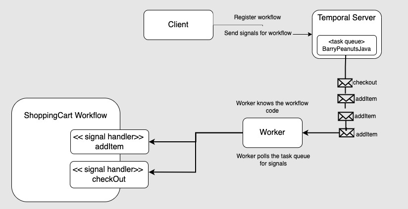

# Implementing the flattened style of the Actor Model under Temporal

This project is an implementation of the flattened style of Actor Model under Temporal.

Temporal supports for the Actor Model out of the box. Intrinsic to the Temporal framework are the Temporal Server and
Worker.

You can think of the Temporal Server as a repository for storing information about the state of the workflow
as well as being the message broker that manages messages relevant to the given workflow’s operation.
The Worker is the component that receives messages and then executes behavior defined in the workflow according to the
message received.
Applications, by way of another Temporal component called a Client send signals to a Temporal workflow. (Remember, under
Temporal, a message is called a signal.)
The Temporal workflow then responds to the signal received. (See Figure 1.)

|                   |
|----------------------------------------------------------------------|
| Figure 1: The Temporal architecture for implementing the Actor Model |

# Running the code:

The [Java Virtual Machine](https://openjdk.org/) and [Maven](https://maven.apache.org/install.html) need to be installed
on the host computer.

## (1) Confirm that Java and Maven are installed on the host machine

Confirm that Java is installed:

```bash
java --version
```

You'll get output similar to the following:

```bash
openjdk 18.0.2-ea 2022-07-19
OpenJDK Runtime Environment (build 18.0.2-ea+9-Ubuntu-222.04)
OpenJDK 64-Bit Server VM (build 18.0.2-ea+9-Ubuntu-222.04, mixed mode, sharing)
```

Confirm that Maven is installed:

```bash
mvn --version
```

```bash
Maven home: /usr/share/maven
Java version: 18.0.2, vendor: Oracle Corporation, runtime: /usr/lib/jvm/jdk-18.0.2
Default locale: en_US, platform encoding: UTF-8
OS name: "linux", version: "5.19.0-46-generic", arch: "amd64", family: "unix"
```

## (2) Download the Temporal CLI (which includes the server)

If you do not have the Temporal server up and running already, run the following command:

`curl -sSf https://temporal.download/cli.sh | sh`

---

## (3) Start the Temporal Server

Here is the command for starting the Temporal Server on a local Ubuntu machine. Execute the command in a terminal
window.

`temporal server start-dev --ip 0.0.0.0`


---

## (4) Start the application

In yet another separate terminal window run:

```
mvn exec:java -Dexec.mainClass="barryspeanuts.BarrysPeanutsExecutor"
```

